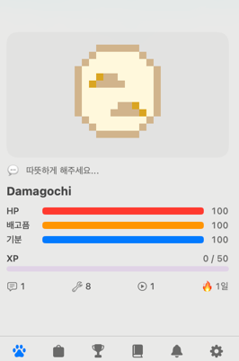

# 🐣 Damagochi

> Claude Code를 사용할 때마다 성장하는 macOS 메뉴바 다마고치 앱

[](https://opensource.org/licenses/MIT)
[](https://www.swift.org)
[](https://www.apple.com/kr/macos)

<div align="center">
  
</div>

## 🎮 소개

**Damagochi**는 당신의 코딩 활동을 추적하고 펫을 키우는 macOS 메뉴바 애플리케이션입니다.

Claude Code의 Hook 시스템과 통합되어, 파일 저장, Git 커밋, 코딩 세션 등의 개발 활동을 감지합니다. 이러한 활동들이 쌓이면서 당신의 펫이 레벨업하고, 새로운 종으로 진화하며, 독특한 성격을 얻습니다.

### 핵심 특징

- 🎨 **픽셀 아트 펫** - 메뉴바에서 귀여운 도트 무늬 펫 감상
- 📈 **XP 기반 성장** - 코딩 활동으로 경험치 적립 및 레벨업
- 🧬 **진화 시스템** - 조건을 만족하면 새로운 종으로 진화
- 💝 **성격 시스템** - 상호작용으로 형성되는 고유의 성격
- 🎖️ **업적 시스템** - 각종 도전 과제 완료 및 수집
- 🛠️ **장비 시스템** - 드롭되는 장비 착용으로 펫 꾸미기
- 📊 **통계 & 추모관** - 키워본 펫들의 기록 관리
- 🤖 **Claude Code 연동** - Hook 자동 설치로 즉시 시작

## 🚀 설치

### Homebrew (권장)

```bash
brew tap keepbang/macagochi
brew install --cask keepbang/macagochi/macagochi
open /Applications/Damagochi.app
```

앱 실행 후 **온보딩 화면에서 Claude Code Hook이 자동으로 등록**됩니다.

### 수동 설치 (개발자용)

요구사항: macOS 14+, Xcode 15+

```bash
git clone https://github.com/keepbang/macagochi.git
cd macagochi
make install
open /Applications/Damagochi.app
```

### 업데이트

```bash
brew update && brew upgrade --cask macagochi
```

## 📖 사용 방법

1. **앱 실행**: `/Applications/Damagochi.app` 더블클릭
2. **Hook 등록**: 온보딩 화면에서 자동 처리
3. **코딩 시작**: Claude Code를 사용하면 자동으로 펫이 성장합니다

### 메뉴바 상호작용

- 🖱️ **클릭**: 펫 터치 (기분과 성격 영향)
- 🖱️ **우클릭**: 메뉴 열기

### 탭별 기능

| 탭 | 설명 |
|---|---|
| 🐾 **펫** | 현재 펫의 상태, 레벨, 경험치 표시 |
| 🎒 **인벤토리** | 착용 가능한 장비 목록 및 착용/해제 |
| 🏆 **업적** | 달성한 업적과 진행 상황 |
| 📖 **추모관** | 지나간 펫들의 기록 |
| ⚙️ **설정** | 알림, Hook 상태, 초기화 등 |

## 🎮 게임 시스템

### 성장 시스템

펫은 다음 활동으로 경험치를 얻습니다:

- 📝 파일 저장: 5 XP
- 💾 Git 커밋: 20 XP
- 🔧 Claude Code 세션: 10 XP (분당)

### 진화 시스템

- **초기 형태** → **중급 형태** (Lv 10 도달)
- **중급 형태** → **최종 형태** (Lv 20 도달 + 특정 성격)

### 성격 시스템

| 성격 | 조건 |
|------|------|
| 🤗 친절함 | 자주 터치할수록 증가 |
| 😎 독립심 | 오래 방치할수록 증가 |
| 🎉 활발함 | 커밋과 활동으로 증가 |
| 😴 게으름 | 활동 부족으로 증가 |

### 건강 & 관리

- ❤️ **체력**: 활동과 휴식으로 회복
- 😋 **포만도**: 시간 경과로 감소 (코딩으로 회복)
- 💀 **사망**: 체력이 0이 되면 발생 (데이터는 추모관에 저장)

## 📋 라이선스

MIT License - [LICENSE](./LICENSE) 파일 참고

## 🙏 감사의 말

- [Swift Argument Parser](https://github.com/apple/swift-argument-parser) - CLI 구현
- Claude Code 팀의 Hook API

---

<div align="center">
  <p><strong>Made with 💜 by keepbang</strong></p>
  <p>
    <a href="https://github.com/keepbang/macagochi">GitHub</a> •
    <a href="https://github.com/keepbang/homebrew-macagochi">Homebrew Tap</a> •
    <a href="https://github.com/keepbang/macagochi/issues">Issues</a>
  </p>
</div>
